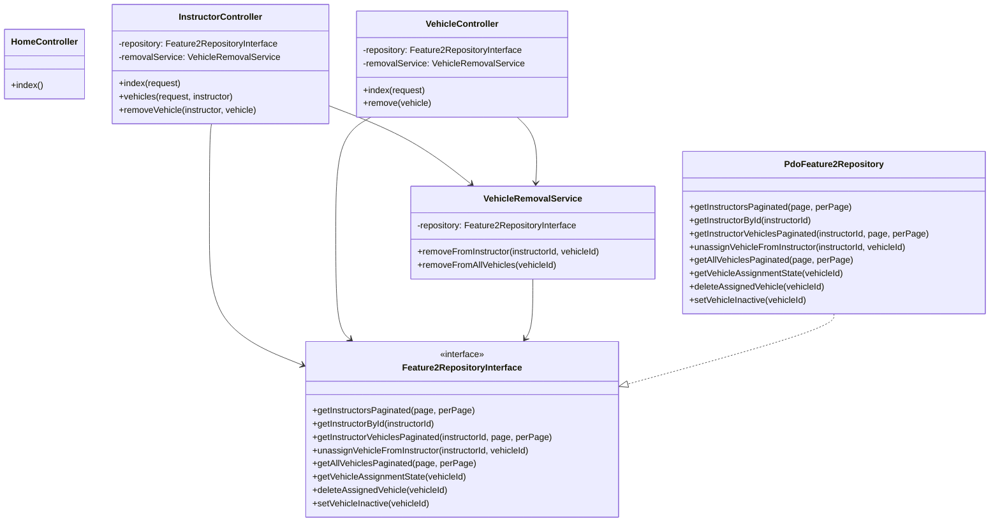

# Class Diagram (Mermaid)

```mermaid
classDiagram
    class HomeController {
      +index()
    }

    class InstructorController {
      -repository: Feature2RepositoryInterface
      -removalService: VehicleRemovalService
      +index(request)
      +vehicles(request, instructor)
      +removeVehicle(instructor, vehicle)
    }

    class VehicleController {
      -repository: Feature2RepositoryInterface
      -removalService: VehicleRemovalService
      +index(request)
      +remove(vehicle)
    }

    class Feature2RepositoryInterface {
      <<interface>>
      +getInstructorsPaginated(page, perPage)
      +getInstructorById(instructorId)
      +getInstructorVehiclesPaginated(instructorId, page, perPage)
      +unassignVehicleFromInstructor(instructorId, vehicleId)
      +getAllVehiclesPaginated(page, perPage)
      +getVehicleAssignmentState(vehicleId)
      +deleteAssignedVehicle(vehicleId)
      +setVehicleInactive(vehicleId)
    }

    class PdoFeature2Repository {
      +getInstructorsPaginated(page, perPage)
      +getInstructorById(instructorId)
      +getInstructorVehiclesPaginated(instructorId, page, perPage)
      +unassignVehicleFromInstructor(instructorId, vehicleId)
      +getAllVehiclesPaginated(page, perPage)
      +getVehicleAssignmentState(vehicleId)
      +deleteAssignedVehicle(vehicleId)
      +setVehicleInactive(vehicleId)
    }

    class VehicleRemovalService {
      -repository: Feature2RepositoryInterface
      +removeFromInstructor(instructorId, vehicleId)
      +removeFromAllVehicles(vehicleId)
    }

    InstructorController --> Feature2RepositoryInterface
    VehicleController --> Feature2RepositoryInterface
    VehicleRemovalService --> Feature2RepositoryInterface
    PdoFeature2Repository ..|> Feature2RepositoryInterface
    InstructorController --> VehicleRemovalService
    VehicleController --> VehicleRemovalService
```
