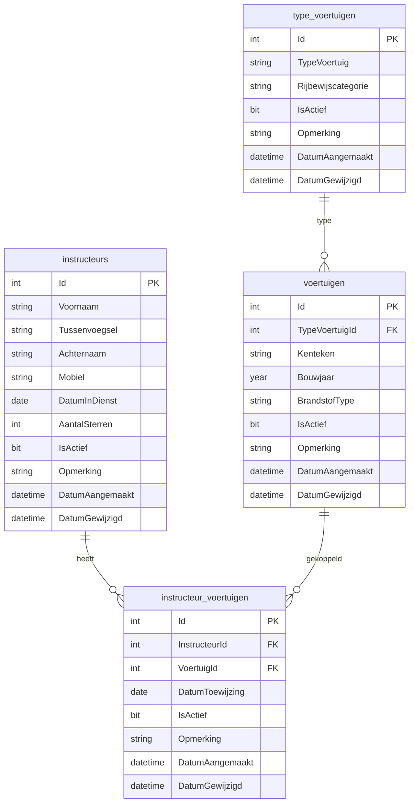

# ERD (Mermaid)

```mermaid
erDiagram
    instructeurs ||--o{ instructeur_voertuigen : heeft
    voertuigen ||--o{ instructeur_voertuigen : gekoppeld
    type_voertuigen ||--o{ voertuigen : type

    instructeurs {
        int Id PK
        string Voornaam
        string Tussenvoegsel
        string Achternaam
        string Mobiel
        date DatumInDienst
        int AantalSterren
        bit IsActief
        string Opmerking
        datetime DatumAangemaakt
        datetime DatumGewijzigd
    }

    type_voertuigen {
        int Id PK
        string TypeVoertuig
        string Rijbewijscategorie
        bit IsActief
        string Opmerking
        datetime DatumAangemaakt
        datetime DatumGewijzigd
    }

    voertuigen {
        int Id PK
        int TypeVoertuigId FK
        string Kenteken
        year Bouwjaar
        string BrandstofType
        bit IsActief
        string Opmerking
        datetime DatumAangemaakt
        datetime DatumGewijzigd
    }

    instructeur_voertuigen {
        int Id PK
        int InstructeurId FK
        int VoertuigId FK
        date DatumToewijzing
        bit IsActief
        string Opmerking
        datetime DatumAangemaakt
        datetime DatumGewijzigd
    }
```
